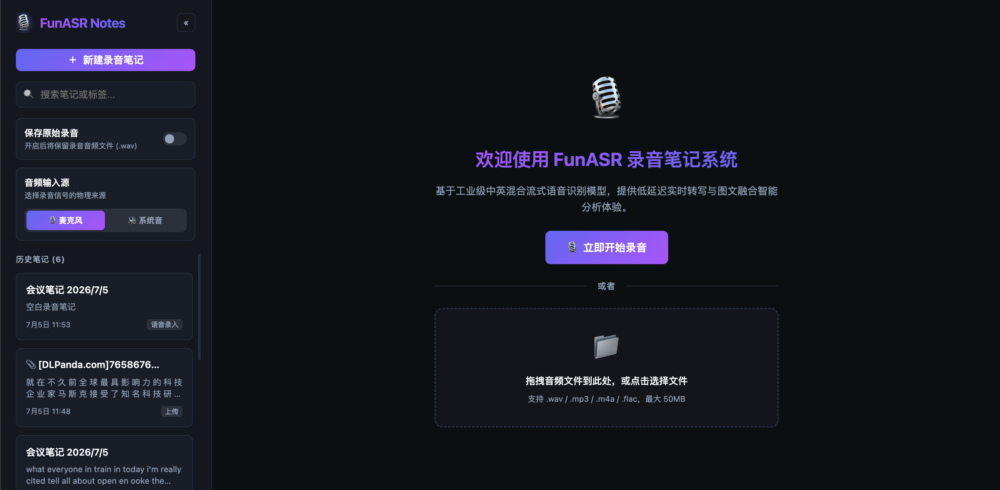
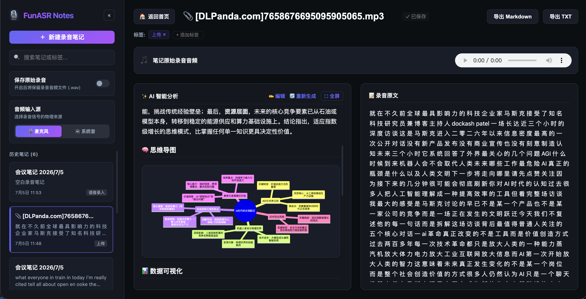

# 🎙️ FunASR Notes

> 本地部署 · 离线运行 · 隐私安全 — 基于工业级流式语音识别与本地大模型的智能录音笔记系统

[](https://opensource.org/licenses/MIT)
[](https://www.python.org/)
[](https://vuejs.org/)
[](https://github.com/modelscope/FunASR)
[]()
[]()

FunASR Notes 是一款**完全本地运行**的智能录音笔记 Web 应用。语音识别由阿里达摩院开源的 [FunASR](https://github.com/modelscope/FunASR) 在本机 CPU 上完成，AI 摘要由本地 [Ollama](https://ollama.com/) 大语言模型离线生成，**所有音频、文字、笔记数据均只存储在本机**，不经过任何外部服务器，从根本上保障会议内容与个人隐私安全。

## ✨ 核心功能

| 功能 | 描述 |
|------|------|
| 🎤 **实时语音转写** | 基于 `paraformer-zh-streaming` 模型，中英混合识别，低延迟逐字输出 |
| 📁 **音频文件上传** | 支持 wav/mp3/m4a/flac 音频上传，后台线程执行离线转写 + AI 整合分析，SSE 实时追踪 |
| 🤖 **AI 离线摘要** | 调用**本地** Ollama 大模型，离线生成结构化摘要，数据不出本机 |
| 💡 **深度思考可视化** | 支持展示 / 折叠模型的 `<think>` 推理过程，流式输出时自动滚动与收纳 |
| 🧠 **智能脑图与图表** | AI 分析自动解析生成 Mermaid 思维导图（支持拖拽和平移缩放）与 ECharts 动态数据统计图 |
| 📁 **侧边栏折叠交互** | 侧边栏支持 320px ↔ 56px 折叠（带过渡动画，小屏自适应），工作区空间自动向外拓宽 |
| ⛶ **AI 分析全屏** | AI 分析面板一键进入/退出全屏，心无旁骛沉浸式阅读总结与导图 |
| 🏠 **首页导航与安全保存** | 点击 Logo 或左上角「🏠 返回首页」一键退回，且在返回前**自动触发静默同步保存**，保障修改不丢失 |
| 📝 **笔记管理** | 支持创建、编辑、删除、标签、全文搜索历史笔记 |
| 🔊 **原始录音保存** | 可选保存 `.wav` 录音文件，支持在线回放 |
| 📤 **多格式导出** | 支持导出 Markdown / TXT 两种格式 |
| 🌙 **暗色界面** | 精心设计的深色 UI，长时间使用不疲眼 |

## 🔒 隐私与安全

> 本项目在设计上以隐私为第一优先级，适合处理**会议记录、课堂笔记、个人日记**等敏感内容。

| 环节 | 处理方式 | 数据去向 |
|------|----------|----------|
| 语音录制 | 浏览器本地采集，通过 **本机 WebSocket** 传输 | 仅到本机后端，不经公网 |
| 语音识别 | FunASR 在**本机 CPU** 推理 | 结果写入本机 SQLite |
| AI 摘要生成 | Ollama 在**本机 GPU/CPU** 推理 | 结果写入本机 SQLite |
| 笔记存储 | SQLite 数据库文件 | `backend/data/notes.db`，仅本机可访问 |
| 音频文件 | 可选保存为 `.wav` | `backend/data/audios/`，仅本机可访问 |

**没有任何数据会被发送到外部服务器。** 断网状态下，语音识别与 AI 摘要均可正常工作。

## 📸 界面预览

**主界面 — 笔记列表与欢迎页**



**笔记详情 — AI 智能摘要 + 录音原文**



## 🏗️ 技术架构

```
notes_app/
├── backend/               # FastAPI 后端
│   ├── main.py            # API 路由 + WebSocket 语音接收
│   ├── summarizer.py      # Ollama 流式摘要（SSE + asyncio.Queue）
│   ├── db.py              # SQLite 数据层
│   └── config.py          # 配置项（模型名、端口、路径等）
└── frontend/              # Vue 3 + Vite 前端
    └── src/App.vue        # 主应用组件（含 EventSource 流式接收）
```

**数据流：**

```
浏览器麦克风
    │  PCM 16kHz 音频流（WebSocket）
    ▼
FastAPI WebSocket
    │  逐帧送入 FunASR paraformer-zh-streaming
    ▼
实时转写结果 → 前端实时展示
    │  录音结束后自动触发
    ▼
Ollama LLM（本地）
    │  Server-Sent Events 流式返回
    ▼
前端打字机效果展示（含深度思考过程）
```

## 🚀 快速开始

### 前置要求

- Python 3.9+
- Node.js 16+
- [Ollama](https://ollama.com/) 已安装并运行

### 第一步：安装 Ollama 并拉取模型

1. 从 [ollama.com](https://ollama.com/) 下载并安装 Ollama
2. 拉取一个支持中文的模型（推荐 gemma 或 qwen 系列）：

```bash
# 推荐：使用 Qwen3（支持深度思考）
ollama pull qwen3:latest

# 或者使用 Gemma4
ollama pull gemma4:latest
```

3. 确认 Ollama 服务正常运行（默认监听 `http://localhost:11434`）：

```bash
ollama list
```

### 第二步：配置后端模型

编辑 `backend/config.py`，将 `LLM_MODEL` 改为你拉取的模型名：

```python
# LLM Config (Ollama)
LLM_BASE_URL = "http://localhost:11434/v1"
LLM_MODEL = "qwen3:latest"   # ← 改为你的模型名
```

### 第三步：安装后端依赖并启动

```bash
# 在项目根目录 (notes_app/) 下执行

# 安装 Python 依赖
pip install -r backend/requirements.txt

# 启动后端（默认监听 http://0.0.0.0:8010）
python -m uvicorn backend.main:app --host 0.0.0.0 --port 8010
```

> **首次启动**会自动从 ModelScope 下载 `paraformer-zh-streaming` 模型（约 250MB），请耐心等待。

### 第四步：安装前端依赖并启动

```bash
cd frontend

# 安装依赖
npm install

# 启动开发服务器
npm run dev
```

前端默认运行在 `http://localhost:5173`，打开浏览器即可使用。

## ⚙️ 配置说明

所有配置项均在 [`backend/config.py`](backend/config.py)：

| 配置项 | 默认值 | 说明 |
|--------|--------|------|
| `MODEL_NAME` | `paraformer-zh-streaming` | FunASR ASR 模型名（支持中英混合流式识别） |
| `SAVE_AUDIO` | `False` | 是否默认保存 WAV 录音文件（可在 UI 中实时切换） |
| `LLM_BASE_URL` | `http://localhost:11434/v1` | Ollama 服务地址 |
| `LLM_MODEL` | `gemma4:latest` | 摘要使用的 LLM 模型名 |
| `PORT` | `8010` | 后端服务端口 |

## 🎯 使用指南

1. **新建录音笔记**：点击左侧「+ 新建录音笔记」按钮，允许浏览器访问麦克风
2. **开始录音**：点击「立即开始录音」，系统实时将语音转为文字
3. **结束录音**：点击停止按钮，AI 自动开始生成结构化摘要
4. **查看摘要**：右侧面板实时以打字机效果展示摘要（包含一句话简述、核心要点、待办事项）
5. **手动重生成**：点击「重新生成」可随时重新触发 AI 摘要
6. **搜索笔记**：通过左侧搜索框，支持按内容或标签全文检索
7. **导出笔记**：点击右上角「导出 Markdown」或「导出 TXT」

## 🔑 关键技术实现

- **流式语音识别**：通过 WebSocket 将浏览器麦克风采集的 16kHz / PCM16 音频流实时发送给后端，FunASR 以 600ms 为一帧进行推理并返回中间结果
- **流式 LLM 摘要**：后端使用 `asyncio.Queue` 构建异步安全的 SSE 生成器，前端通过原生 `EventSource` 接收，实现零轮询的流式打字效果
- **深度思考解析**：自动检测模型返回的 `reasoning` / `reasoning_content` 字段，将推理过程包裹为 `<think>...</think>` 标签，前端解析后以可折叠区块展示
- **断线保护**：录音中途关闭浏览器时，后端会将已录制的音频落盘并更新数据库，防止数据丢失

## 📦 依赖

### 后端

| 依赖 | 用途 |
|------|------|
| `fastapi` | Web 框架 + WebSocket + SSE |
| `uvicorn` | ASGI 服务器 |
| `python-multipart` | FastAPI 上传表单数据解析库 |
| `funasr` | 本地语音转写与 VAD 引擎 |
| `langchain-openai` | LLM 调用封装 |
| `openai` | Ollama 兼容的 OpenAI 客户端（流式摘要） |

### 前端

| 依赖 | 用途 |
|------|------|
| `vue` 3 | 响应式 UI 框架 |
| `vite` | 构建工具 |
| `marked` | Markdown 解析渲染 |
| `mermaid` | 思维导图解析渲染与平移缩放视图 |
| `echarts` | 数据图表可视化组件 |
| `lucide-vue-next` | 图标库 |

## 📄 License

本项目基于 [MIT License](LICENSE) 开源，欢迎自由使用、修改和分发。

## 🙏 致谢

- [FunASR](https://github.com/modelscope/FunASR) — 达摩院开源的工业级语音识别框架
- [Ollama](https://ollama.com/) — 本地大模型运行平台
- [paraformer-zh-streaming](https://modelscope.cn/models/iic/speech_paraformer-large_asr_nat-zh-cn-16k-common-vocab8404-online) — 中英混合流式 ASR 模型

## 🤝 私有化部署与二次开发

如果您需要更深度的定制服务、企业私有化部署支持、二次开发或技术咨询，欢迎通过下方联系方式与我取得联系：


